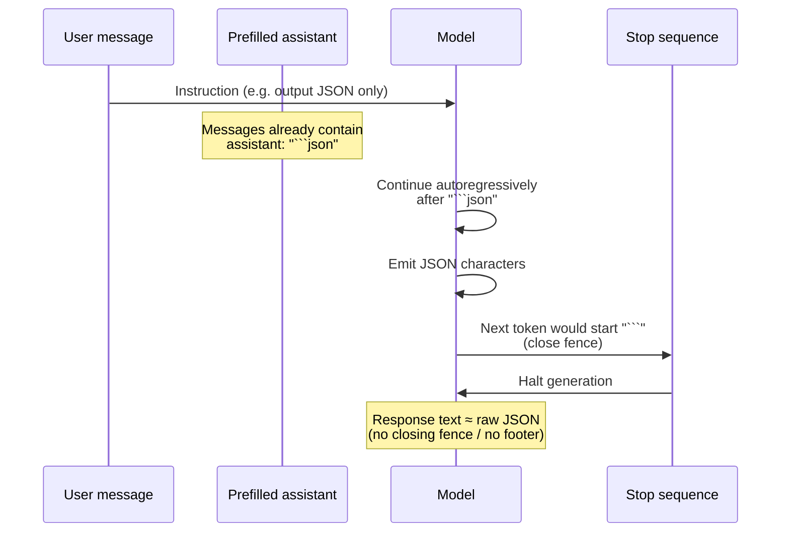

# Claude — structured output (JSON) without markdown wrappers

Notes on getting **machine-parseable** text (especially JSON) from Claude **without** fenced code blocks, preamble, or trailing commentary—using **assistant message prefilling** and **stop sequences**. Useful for **APIs**, **pipelines**, and **UX** where raw JSON (or code, CSV, etc.) is required.

## Overview

By default, asking for “JSON” often yields:

- A **markdown fence** (e.g. ` ```json ` … ` ``` `)
- Optional **explanation** before or after (“Here is the JSON…”)

That is fine for humans but awkward for programs: you must strip fences and prose. A common pattern is to **prefill** the assistant turn so the model **continues** as if it already opened a code block, then **stop** generation as soon as it tries to **close** the fence—so you never pay for or parse the closing fence or extra chat.

## The problem with default responses

You might get valid JSON but wrapped like this:

````markdown
```json
{ "source": ["aws.ec2"], ... }
```

This rule captures EC2 instance state changes when instances start running.
````

The JSON is correct, but for a web app or backend that expects **only** JSON, you add parsing friction and risk fence/prose edge cases.

## Solution: assistant prefilling + stop sequences

**Idea:** Append an **assistant** message whose content is the **start** of the format you want (e.g. the opening of a markdown code block for JSON). That prefill does **not** have to be only a fence or a single word—you can include **partial example output** so the model continues in the same style (see **Rich prefills** below). Send the user instruction as usual. When you call the chat/Messages API, pass **`stop_sequences`** that match what the model would emit **next** when “finishing” that wrapper—often the **closing** triple backticks `` ``` ``.

**Sketch (conceptual):**

```python
messages = []

add_user_message(messages, "Generate a very short EventBridge rule as JSON.")
add_assistant_message(messages, "```json")

text = chat(messages, stop_sequences=["```"])
```

- **User message** — What to generate (the task).
- **Prefilled assistant message** — Steers continuation: the model writes **after** ` ```json ` as if inside the block.
- **`stop_sequences`** — When the model would output `` ``` `` to close the block, generation **stops** there; that closing token sequence does not need to appear in your stored string (behavior depends on how your SDK exposes the final assistant text—often you get content **up to but not including** the stop sequence).

For **JSON** output, parse in Python:

```python
import json

clean = json.loads(text.strip())
```

`strip()` removes stray newlines around the payload; adjust if your schema legitimately needs leading/trailing whitespace (rare for JSON).

### Rich prefills: examples inside the assistant turn

Prefilling is **not** limited to ` ```json ` or bare markers. The assistant message can already contain:

- The **fence** and **language tag** (e.g. `bash`), **and**
- One or more **example lines** that show the **exact shape** you want (flags, subcommands, quoting).

That gives the model a **concrete template** to continue from—similar to few-shot, but fixed in the **assistant** prefix so the next tokens stay on-format. Your **user** message still states the task (e.g. “give **three** different sample AWS CLI commands,” “vary or omit `--profile`,” etc.); the **prefill** shows *what “good” looks like* so Claude aligns with “that’s the format we want.”

**Exercise pattern (conceptual):** generate several sample `aws` CLI commands → open a shell block in the prefill, optionally add **one** example command line, then let the model emit the **remaining** lines before the closing fence hits the stop sequence.

```python
add_user_message(
    messages,
    "Generate three different sample AWS CLI commands. "
    "Vary style; include or omit flags like --profile where it makes sense."
)
add_assistant_message(
    messages,
    """```bash
aws s3 ls
"""
)
text = chat(messages, stop_sequences=["```"])
```

**Caveats:** Reserve enough **`max_tokens`** for everything **after** what you put in the prefill. If the prefill is long, the model has less room to complete the task. Re-check that your **stop** string still cannot appear inside valid output (unusual for typical CLI one-liners, but worth remembering for arbitrary text).

**Processing:** For **JSON**, use `json.loads` as above. For **non-JSON** fenced text (e.g. AWS CLI lines), treat the returned string as plain text: `splitlines()`, strip, filter empty lines—whatever your app needs; do not run `json.loads` unless the block is actually JSON.

## How the flow works (mental model)



**In short:**

1. The **user** tells Claude **what** to produce.
2. The **prefill** makes Claude believe it **already started** the markdown JSON block.
3. Claude continues with **just the payload** (the JSON body).
4. When it tries to **close** with `` ``` ``, the **stop sequence** fires and generation ends—no closing fence, no “here is your JSON” footer.

For how this relates to **stop reason** in the API response, see `api_usage.md` (e.g. generation ending on a stop sequence vs. end of turn).

## Beyond JSON

The same pattern applies whenever you want **content without commentary**:

| Target output        | Prefill / framing idea        | Stop / boundary idea                          |
| -------------------- | ----------------------------- | --------------------------------------------- |
| **JSON**             | ` ```json `                   | `` ``` ``                                     |
| **Python**           | ` ```python `                | `` ``` ``                                     |
| **CSV / plain list** | Start delimiter you control   | Stop on delimiter that ends the “pure” region |
| **Bullets**          | First line or marker          | Stop before closing explanation               |
| **CLI / code lines** | Fence + **one example line**  | `` ``` `` — model continues matching style     |

The trick is to **match what the model naturally uses** to wrap output (often markdown fences), then use that structure as **prefill + stop**. Optionally **seed** the block with a short **example** so continuation matches your conventions.

## Trade-offs

| Upside                              | Downside / nuance                                                                 |
| ----------------------------------- | --------------------------------------------------------------------------------- |
| Clean, parseable output             | You must **design** prefill/stop for each format                                  |
| Less post-processing                | Wrong stop string → truncation or extra text; **test** edge cases                 |
| Works with streaming conceptually   | Ensure stream aggregation matches **non-streaming** semantics for stop boundaries |

## Pitfalls

- **JSON inside JSON** — If the payload could contain the substring `` ``` ``, a naive stop on `` ``` `` could truncate early. Prefer **structured outputs** / schema-constrained APIs when available, or choose stops that cannot appear in valid payloads.
- **Schema validation** — `json.loads` succeeding does not mean the object matches your **API contract**; validate with a schema (e.g. Pydantic, JSON Schema).
- **API details** — Parameter names (`stop_sequences`), message roles, and **max output tokens** are defined in the **current** Anthropic docs; verify for your SDK version.

## Interview angles

- *“How do you return only JSON from an LLM?”* — Prefill assistant + stop sequences, or native **tool use** / **structured outputs** if the platform supports them; always **validate** parsed JSON.
- *“Why does the model add markdown?”* — Training and helpfulness defaults; you steer format with **prompt + prefill + stops** (or product features).
- *“What is assistant prefilling?”* — Supplying the **beginning** of the assistant reply so the model **continues** from that state—useful for format control and consistency.
- *“Is prefill only the code fence?”* — No; you can include **sample lines** (few-shot-by-position) so the model locks onto the right **shape** (e.g. AWS CLI samples).

## Quick recap

- Default “give me JSON” answers often include **fences and prose**; apps want **raw JSON**.
- **Prefill** the assistant message with the **opening** of the wrapper (e.g. ` ```json `)—optionally plus an **example line** so the model matches format (CLI, lists, etc.).
- **`stop_sequences`** with the **closing** fence (e.g. `` ``` ``) ends generation before that closing fence is finalized—yielding **clean** text for `json.loads(text.strip())`.
- Generalizes to other **structured** or **delimited** outputs; watch **collision** between stop strings and payload content.

## See also

- `api_usage.md` — stop reasons, `max_tokens`, request shape.
- `multi_turn_conversations.md` — how assistant turns fit in the message list.
